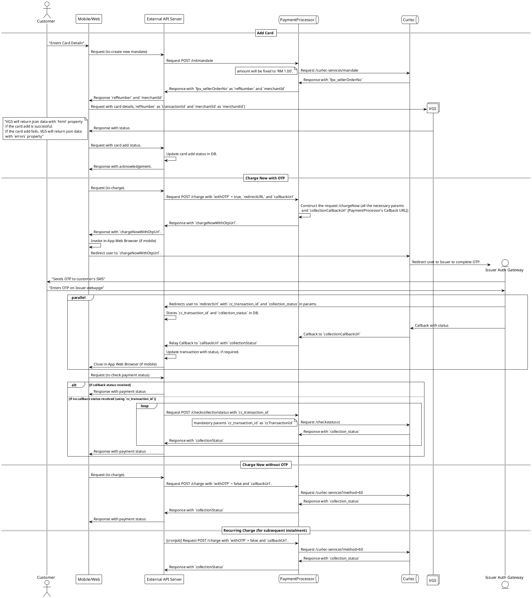

# Payment Processor Interface

Payment Processor interface works as an adapter for handling payment processing between AiraPay / Moby platform and vendors.

- [Payment Processor Interface](#payment-processor-interface)
  - [Environment](#environment)
    - [Sandbox Base URL](#sandbox-base-url)
      - [API Versioning](#api-versioning)
  - [Sequence Diagram](#sequence-diagram)
  - [ENUM Definitions](#enum-definitions)
    - [Client Type (`clientType`)](#client-type-clienttype)
    - [Response Code (`responseCode`)](#response-code-responsecode)
    - [Error Message (`errorMsg`)](#error-message-errormsg)
    - [Collection Status (`collectionStatus`)](#collection-status-collectionstatus)
  - [Endpoints](#endpoints)
    - [Init Mandate API](#init-mandate-api)
      - [Request](#request)
        - [Request Body](#request-body)
      - [Response](#response)
    - [Charge API](#charge-api)
      - [Request](#request-1)
        - [Request Body](#request-body-1)
      - [Response](#response-1)
      - [Callback](#callback)
    - [Check Collection Status API](#check-collection-status-api)
      - [Request](#request-2)
        - [Request Body](#request-body-2)
      - [Response](#response-2)
  - [VGS Endpoint](#vgs-endpoint)
    - [Request](#request-3)
    - [Response (Sample)](#response-sample)

---

## Environment

### Sandbox Base URL

```
https://sandbox.payment.mobypay.my/api/payment/{version}
```

#### API Versioning

| Version Number | Status    |
| -------------- | --------- |
| v2.0.0         | Available |

## Sequence Diagram

<details>
  <summary>Click to expand</summary>



</details>

## ENUM Definitions

---

### Client Type (`clientType`)

| Client Type (`clientType`) | Description |
| -------------------------- | ----------- |
| 1                          | AiraPay     |
| 2                          | Moby        |

### Response Code (`responseCode`)

| Response Code (`responseCode`) | Description |
| ------------------------------ | ----------- |
| 00                             | Success     |
| 01                             | Failed      |

### Error Message (`errorMsg`)

| Error Message (`errorMsg`)  | Description                                    |
| --------------------------- | ---------------------------------------------- |
| "Mandatory value is empty!" | Malformed or missing value required in request |

### Collection Status (`collectionStatus`)

Refer to Curlec's documentation: [Collection Status](https://api.curlec.com/#tag/Collection-Status)

## Endpoints

### Init Mandate API

After Init Mandate API is called, the VGS endpoint must be called. Refer to **VGS Endpoint**.

```
POST /initmandate
```

#### Request

##### Request Body

Schema: `application/json`

| Property     | Type    | Description                                     |
| ------------ | ------- | ----------------------------------------------- |
| `clientType` | Integer | Refer to **Client Type**.                       |
| `email`      | String  | Email address of the payer                      |
| `mobileNo`   | String  | Mobile number of the payer. Include prefix `60` |
| `nameOnCard` | String  | Cardholder Name of the payer                    |
| `idValue`    | String  | Payer's MyKad Number                            |

```json
{
  "clientType": 1,
  "email": "abc@example.com",
  "mobileNo": "60123456789",
  "nameOnCard": "Customer Name",
  "idValue": "000101062304"
}
```

#### Response

Schema: `application/json`

| Property       | Type   | Description                                                                                       |
| -------------- | ------ | ------------------------------------------------------------------------------------------------- |
| `responseCode` | String | Refer to **Response Code**.                                                                       |
| `errorMsg`     | String | Refer to **Error Message**.                                                                       |
| `merchantId`   | String | Required for `merchantId` in VGS Endpoint.                                                        |
| `refNumber`    | String | The reference number of the mandate. Required for Charge API and `transactionId` in VGS Endpoint. |

```json
{
  "responseCode": "00",
  "merchantId": "5354721",
  "refNumber": "AP0000000001"
}
```

### Charge API

```
POST /charge
```

#### Request

##### Request Body

Schema: `application/json`

| Property      | Type    | Description                                                                                                                                                                                                                                                                                                                                                 |
| ------------- | ------- | ----------------------------------------------------------------------------------------------------------------------------------------------------------------------------------------------------------------------------------------------------------------------------------------------------------------------------------------------------------- |
| `clientType`  | Integer | Refer to **Client Type**.                                                                                                                                                                                                                                                                                                                                   |
| `amount`      | Float   | Charge amount in MYR, only accepts 2 decimal places.                                                                                                                                                                                                                                                                                                        |
| `refNumber`   | String  | The reference number of the mandate.                                                                                                                                                                                                                                                                                                                        |
| `billCode`    | String  | The bill code of the order.                                                                                                                                                                                                                                                                                                                                 |
| `withOtp`     | Boolean | If `true`, an URL will be returned for payer to complete transaction.                                                                                                                                                                                                                                                                                       |
| `redirectUrl` | String  | Required for `withOtp` = `true`. Payer will be redirected to this URL with params `cc_transaction_id` and `collection_status` after transaction is completed. Sample query string that will be returned: `<redirectUrl>?reference_number=22072021-1650&invoice_number=INV001&collection_status=SUCCESSFULLY_COMPLETE&cc_transaction_id=f6f-10032021-139*13` |
| `callbackUrl` | String  | Collection status will be notified to this URL.                                                                                                                                                                                                                                                                                                             |

`withOtp` = `true`

```json
{
  "clientType": 1,
  "amount": 100.0,
  "refNumber": "AP0000000001",
  "withOtp": true,
  "redirectUrl": "https://.....",
  "callbackUrl": "https://....."
}
```

`withOtp` = `false`

```json
{
  "clientType": 1,
  "amount": 100.0,
  "refNumber": "AP0000000001",
  "withOtp": false,
  "callbackUrl": "https://....."
}
```

#### Response

Schema: `application/json`

| Property              | Type   | Description                                                                                                            |
| --------------------- | ------ | ---------------------------------------------------------------------------------------------------------------------- |
| `responseCode`        | String | Refer to **Response Code**.                                                                                            |
| `errorMsg`            | String | Refer to **Error Message**.                                                                                            |
| `chargeNowWithOtpUrl` | String | Conditional: `withOtp` = `true`. The URL to redirect Payer to complete transaction.                                    |
| `ccTransactionId`     | String | Conditional: `withOtp` = `false`. Unique reference number of this transaction. Required for checking collection status |
| `refNumber`           | String | The reference number of the mandate.                                                                                   |
| `billCode`            | String | The bill code of the order.                                                                                            |
| `collectionStatus`    | String | Conditional: `withOtp` = `false`. The collection status of the charge. Refer to **Collection Status**.                 |

`withOtp` = `true`

```json
{
  "responseCode": "00",
  "chargeNowWithOtpUrl": "https://....",
  "refNumber": "AP0000000001",
  "billCode": "20934893"
}
```

`withOtp` = `false`

```json
{
  "responseCode": "00",
  "ccTransactionId": "12093840930",
  "refNumber": "AP0000000001",
  "billCode": "20934893",
  "collectionStatus": "SUCCESSFULLY_COMPLETE"
}
```

#### Callback

Schema: `application/json`

| Property           | Type   | Description                                                                           |
| ------------------ | ------ | ------------------------------------------------------------------------------------- |
| `refNumber`        | String | The reference number of the mandate.                                                  |
| `billCode`         | String | The bill code of the order.                                                           |
| `ccTransactionId`  | String | Unique reference number of this transaction. Required for checking collection status. |
| `collectionStatus` | String | Refer to **Collection Status**.                                                       |

```json
{
  "refNumber": "AP0000000001",
  "billCode": "430943",
  "ccTransactionId": "6049038434",
  "collectionStatus": "SUCCESSFULLY_COMPLETE"
}
```

### Check Collection Status API

```
POST /checkcollectionstatus
```

#### Request

##### Request Body

Schema: `application/json`

| Property          | Type    | Description                                |
| ----------------- | ------- | ------------------------------------------ |
| `clientType`      | Integer | Refer to **Client Type**.                  |
| `ccTransactionId` | String  | Unique reference number of the transaction |

```json
{
  "clientType": 1,
  "ccTransactionId": "1209380943"
}
```

#### Response

Schema: `application/json`

| Property           | Type   | Description                                                                           |
| ------------------ | ------ | ------------------------------------------------------------------------------------- |
| `responseCode`     | String | Refer to **Response Code**.                                                           |
| `errorMsg`         | String | Refer to **Error Message**.                                                           |
| `ccTransactionId`  | String | Unique reference number of this transaction. Required for checking collection status. |
| `collectionStatus` | String | Refer to **Collection Status**.                                                       |

```json
{
  "responseCode": "00",
  "ccTransactionId": "6049038434",
  "collectionStatus": "SUCCESSFULLY_COMPLETE"
}
```

## VGS Endpoint

This endpoint must be called after `POST /initmandate` by the mobile / web client.

**Sandbox URL:** `https://tntfrffpxdd.sandbox.verygoodproxy.com/creditCard/vgsMandate`

### Request

```shell
https://tntfrffpxdd.sandbox.verygoodproxy.com/creditCard/vgsMandate -H "Content-type: application/json" -d '{ \
	"merchantId": "24520", \
    "transactionId": "DAA-22-89", \
    "type": "mandate", \
    "card_name": "Customer Name", \
    "card_number": "4929450168585708", \
    "card_cvc": "123", \
	"card_exp": "06 / 25" \
}'
```

| Property        | Type   | Description                                      |
| --------------- | ------ | ------------------------------------------------ |
| `merchantId`    | String | The `merchantId` received from Init Mandate API. |
| `transactionId` | String | The `refNumber` received from Init Mandate API.  |
| `type`          | String | Fixed value: `mandate`                           |
| `card_name`     | String | The cardholder's name.                           |
| `card_number`   | String | The card number (PAN).                           |
| `card_cvc`      | String | The CVC of the card.                             |
| `card_exp`      | String | The card expiry in format: `MM / YY`             |

### Response (Sample)

**If Card Add Success:**

```
{"html":["<form id=\"curlecForm\" method=\"POST\" action=\"https://uat.curlec.com/home/cc-mandate-status/VGSZER-11042022-400626156/ZER-11042022-4\"> <input type=\"hidden\" name=\"order.id\" value=\"ZER-11042022-4\" /> <input type=\"hidden\" name=\"transaction.id\" value=\"ZER-11042022-4\" /> <input type=\"hidden\" name=\"response.gatewayRecommendation\" value=\"PROCEED\" /> <input type=\"hidden\" name=\"result\" value=\"SUCCESS\" /> <\/form>"]}
```

**If Card Add Fail:**

```
{"errors":[{"field":"Merchant","value":"","message":"Merchant Credit Card is not properly set up"}]}
```
